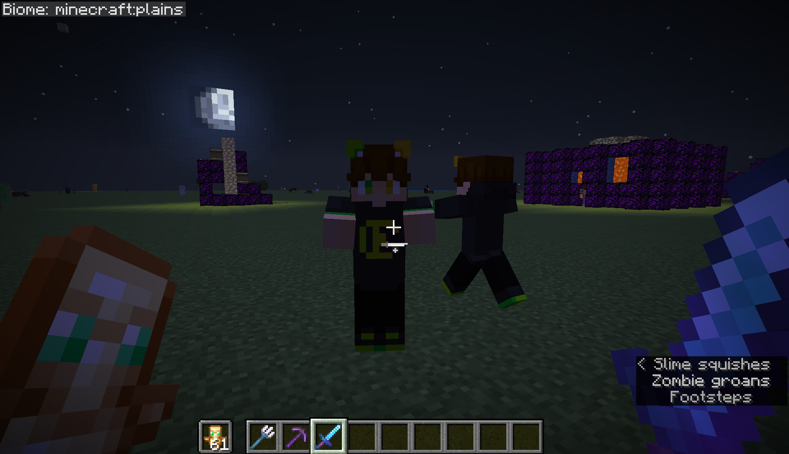

# Kenadian_Zombies
Do you want to make Minecraft Zombies look like Kenadian? No? 
 
Disclaimer: I am not affiliated with Kenadian, and did not obtain their permission.

Kenadian skin, [audio clip](https://youtu.be/4gCc--BGW30?t=115), etc copyright Kenadian. 
Code based on [https://modrinth.com/resourcepack/zombie-creeper](https://modrinth.com/resourcepack/zombie-creeper) by piramiduss. 
All original work, such as the subtitle modification, is copyleft 2026. 
[More information](https://www.reddit.com/r/PhoenixSC/comments/1rb3agv/comment/o6vo51y/).

### What does this resource pack do?
- All zombies use the Kenadian skin

Even since Mojang updated the baby zombie texture, baby zombies do not use the Ken skin. 
Other zombies (Husks, Drowned, etc) do not use the Ken skin.
- Dying zombies play the sound bite "I'm sorry Kenadian"

This is regardless of how the zombie dies.
- Dying zombies show the subtitle "Kenadian dies"

Don't think to hard about it.
